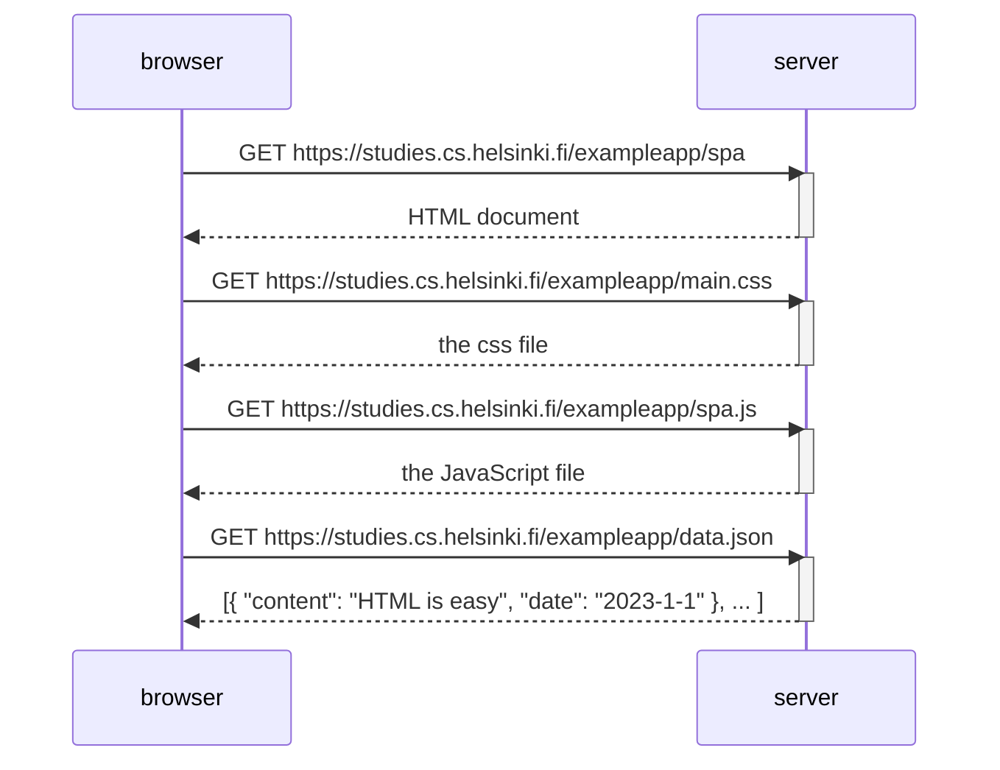

### Sequence diagram for accessing the single-page version of the notes app through https://studies.cs.helsinki.fi/exampleapp/spa:

> In this case, the diagram is similar to accessing the norma version of the webpage. The client makes a request to the exampleapp/spa adress, which
> prompts the loading of the css, js, and raw data of the notes. The differences will start to show when the users makes the post request in the next exercise
