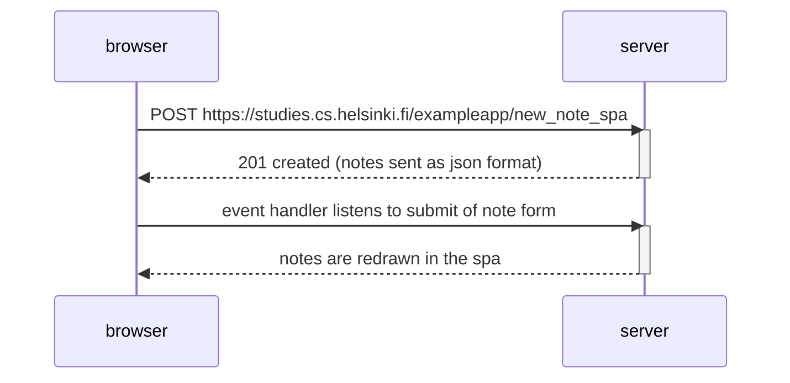

### Sequence diagram for saving a note the single-page version of the notes app:

```mermaid
sequenceDiagram
    participant browser
    participant server

    browser->>server: POST https://studies.cs.helsinki.fi/exampleapp/new_note_spa
    activate server
    server-->>browser: 201 created (notes sent as json format)
    deactivate server

    browser->>server: event handler listens to submit of note form
    activate server
    server-->>browser: notes are redrawn in the spa
    deactivate server

```
